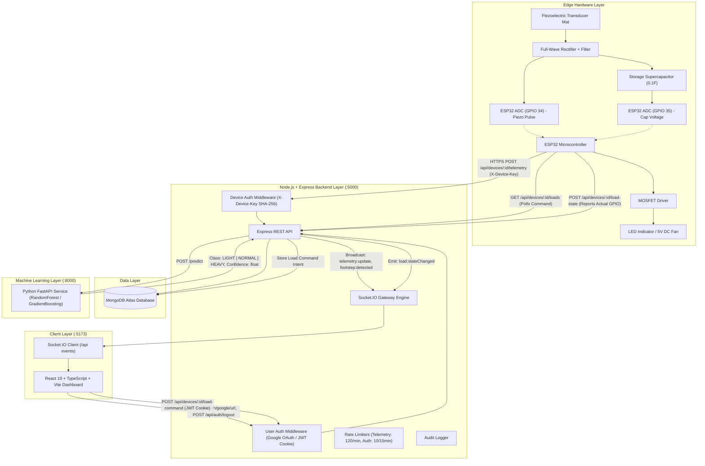

# StepCharge AI — Architecture & Dataflow

This document describes the complete architecture of StepCharge AI after migrating away from Firebase to **MongoDB Atlas**, **Node.js + Express + TypeScript**, **Google OAuth 2.0**, **Socket.IO**, and **ESP32 HTTPS REST**.

---

## 1. System Topology

---

## 2. Component Specifications

### 2.1 Edge IoT Layer (ESP32)
- **ADC Sampling**: Reads piezo pulse on GPIO 34 and capacitor voltage on GPIO 35 with 16x hardware oversampling and Exponential Moving Average (EMA) filtering ($\alpha = 0.25$) to suppress ambient EMI.
- **Footstep Detection**: Dual Schmitt trigger with hysteresis ($V_{\text{high}} = 1.2\,\text{V}$, $V_{\text{low}} = 0.6\,\text{V}$) and a 200 ms refractory lock-out window.
- **Authentication**: Sends `X-Device-Key: <plain_token>` in HTTP request headers over TLS/HTTPS.
- **Load Control Feedback Loop**: Reads desired state via `GET /api/devices/:id/loads`, switches GPIO 25/26 via MOSFET, reads actual physical voltage/state, and reports back via `POST /api/devices/:id/load-state`.

### 2.2 Backend Service (Node.js + Express)
- **Port**: 5000
- **Process Manager**: TSX in development, PM2 / Node cluster in production.
- **Security**: Helmet HTTP headers, CORS whitelisting, HTTP-only JWT cookies, SHA-256 device key verification.
- **Real-Time Engine**: Socket.IO room subscriptions (`device:<deviceId>`).

### 2.3 Database Layer (MongoDB Atlas)
- **Engine**: MongoDB 7.0+ (Mongoose ODM).
- **Collections**: `users`, `devices`, `telemetry`, `footsteps`, `alerts`, `dataset_samples`, `model_metadata`, `audit_logs`.
- **Indexes**: Compound index on `{ deviceId: 1, timestamp: -1 }` on `telemetry` and `footsteps` for sub-millisecond real-time queries.

### 2.4 ML Microservice (Python FastAPI)
- **Port**: 8000
- **Model**: Scikit-Learn `RandomForestClassifier` trained on physical features:
  - `storageVoltage` ($V_{\text{cap}}$)
  - `peakVoltage` ($V_{\text{peak}}$)
  - `averageVoltage` ($V_{\text{avg}}$)
  - `pulseDuration` ($t_{\text{ms}}$)
  - `stepInterval` ($\Delta t_{\text{ms}}$)
- **Classes**: `LIGHT` ($< 1.8\,\text{V}$), `NORMAL` ($1.8\text{--}3.2\,\text{V}$), `HEAVY` ($> 3.2\,\text{V}$).
- **Resilience**: If the ML service is offline or unreachable, the Node.js backend tags footsteps with `classification: null` and `confidence: null` without failing telemetry writes.

### 2.5 Web Dashboard (React + Vite)
- **Port**: 5173
- **State Management**: Context Store with fallback mechanisms between Live streaming (Socket.IO + REST) and isolated Demo mock simulation.
- **UI Safety**: Strict visual distinction between command intent and confirmed GPIO hardware state.
